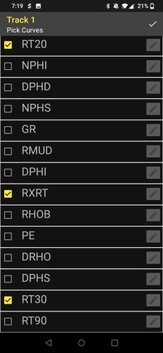

# Description
This Android app was the final project for a Mobile App Development course. It was a group project with four members. It interprets and graphs Log ASCII Standard (LAS) files. These files are commonly used in the oil and gas industries for sub surface scanning to detect optimal drill sites. 

 

For more details on the project see the [Final Project Report](https://github.com/mattjroberson/QuickLas/blob/master/CS4153-QuickLASFinalReport.pdf).

## <ins>Members</ins>
* __Roden, Jeff__ - Project Lead
* __Roberson, Matthew__ - Lead Programmer
* __Yeager, Jessey__ - Lead Designer
* __Stott, Lucas__ - Secondary Programmer & Designer

<!-- ## <ins>Features</ins>
Add Features Here

# Snapshots
 

  
Video Demonstration: -->

# Build Instructions
This project was built inside the Android Studio IDE. Clone the repo and import the project into Android Studio to build.

Follow the instructions in the [Final Project Report](https://github.com/mattjroberson/QuickLas/blob/master/CS4153-QuickLASFinalReport.pdf) to import the demo LAS file into the Android Emulator.

# Possible Improvements
* Late in the production, we realized the graphing library was only designed to implement line charts in the horizontal direction. The nature of the app dictated that we use the vertical orientation. The solution we arrived at that allowed us to finish on schedule was to force the screen rotation when displaying the graph. This is a sub optimal patch that could be resolved with an improved graphing library.

# Known Bugs
* There are no bugs currently being tracked

# Contributions & Licensing
This project is closed to development, however feel free to fork and use any part of the codebase.

# Acknowledgements
This project relies on https://github.com/PhilJay/MPAndroidChart for the graphing interface.
